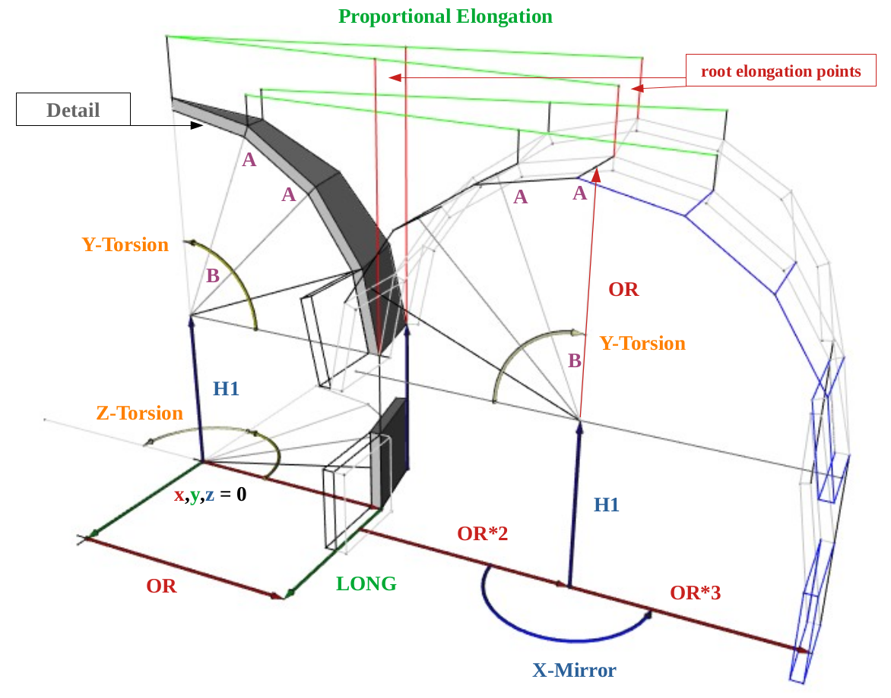

# FreeCAD World
Macro system of FreeCAD World

In front of you a machine tool for the production of any FreeCAD Macros of any complexity with increased accuracy of calculation of target objects of polygonal and orthogonal geometry.
At current stage it works as calc for practical designs of buildings and for overall development of kids, students, individuals and households.
## The Principle

(Check out principle at: docs/principle.FCStd)

YouTube presentation:

## dependencies: FreeCAD + python3 build
